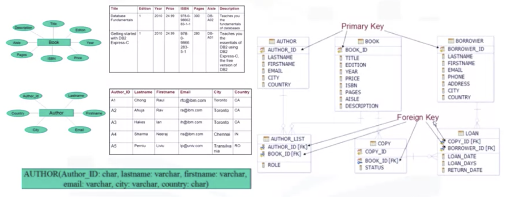

# CREATE TABLE Statement

---

## 학습 목표

* Data Definition Language 에서의 선언문과 ㅇData Manipulation Language 선언문을 구분할 수 있다
* 관계형 데이터베이스를 만드는 데에 Entity 명과 특성(attributes) 가 사용되는 방법을 설명할 수 있다

---

## 5가지 선언문

* 5가지 선언문
  * Create the table
  * Insert data
  * Select data
  * Update data
  * Delete data
* DDL (Data Definition Language): 데이터의 정의, 변형, 삭제와 관련된 선언
* DML (Data Manipulation Language): 데이터의 읽기와 가공

---

## Create a table



---

## CREATE TABLE statement

* CREATE TABLE 문을 이용해서 테이블 만들기

```sql
CREATE TABLE author
  (author_id CHAR(2) CONSTRAINT AUTHOR_PK PRIMARY KEY (author_id) NOT NULL,
  lastname VARCHAR (15) NOT NULL,
  firstname VARCHAR (15) NOT NULL,
  email VARCHAR(40),
  city VARCHAR(15),
  country CHAR(2)
  )
```

* author_id: 기본키, 테이블의 중복값을 방지
* lastname, firstname: NOT NULL, NULL 값이 들어올 수 없도록 제한

---

## Summary

* DDL 문과 DML 문을 구별할 수 있다
* 관계형 데이터베이스를 만드는 데에 엔티티 이름과 특성들이 사용되는 방식에 대해 설명할 수 있다
