# 추천시스템 소개

목차

1. MovieLens 돌아보기
2. 선호와 평가
3. 예측과 추천
4. 추천 모델 분류 1
5. 추천 모델 분류 2
6. Amazon.com 돌아보기
7. 추천 시스템의 과거와 현재, 그리고 미래

## MovieLens 돌아보기

* 주소: movielens.org

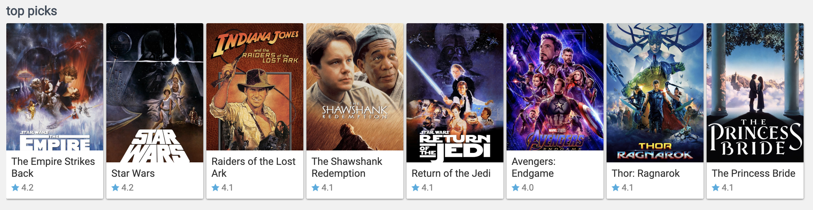

### 제공하는 기능

* 점수
  * 별 5개 만점, 0.5개 단위로 조정 가능
  * 예상 점수: 파란색 별점으로 표시됨
  * 본인의 평가: 주황색 별점으로 표시됨
* 추천 카테고리
  * top picks
  * favorite from last year
  * your wishlist
  * etc.
* 추천 시스템 종류
  * The wizard
  * The worrior
  * The peasant: non-personalized recommender
  * etc.
  * personalized your recommendations
    * 추천 시스템을 일부 조정하여 입맛에 맞도록 일부 조정할 수 있음

### 하나의 영화를 선택했을 때의 화면

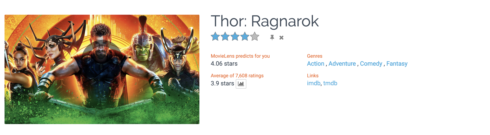

* 예상 별점, 예상 평점, 평균 평점, 장르, 외부 링크

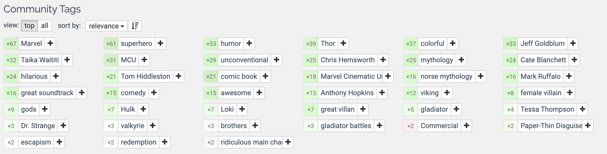

* 사용자들이 입력한 영화 관련된 키워드

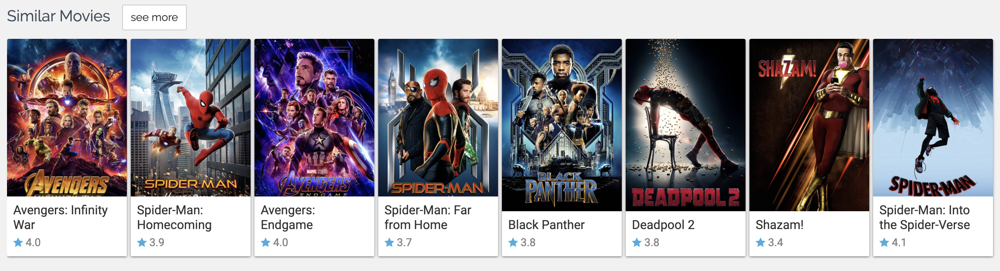

* 태그로 찾은 유사한 영화

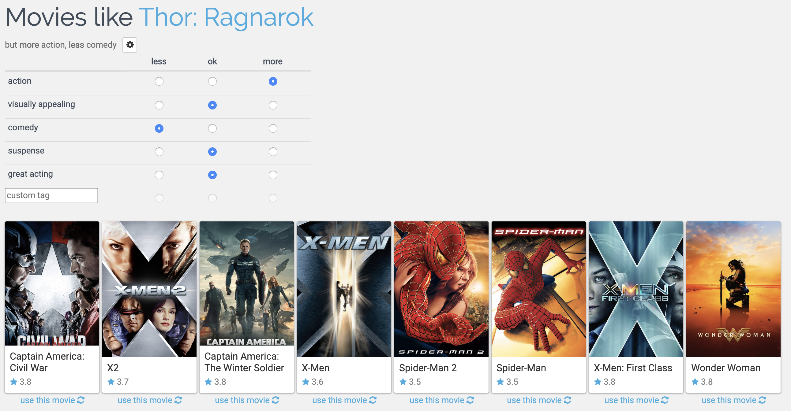

* 유사한 영화에 대한 선호를 조절하여 보다 취향에 맞는 영화를 찾을 수 있음

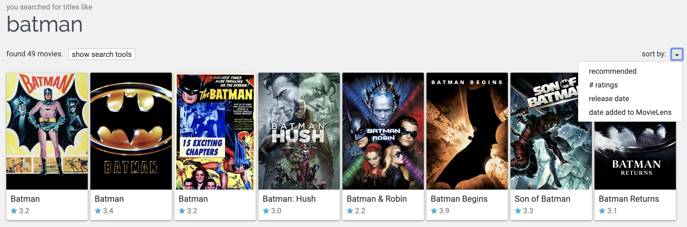

* 검색한 영화의 정렬 순서를 바꿔서 볼 수 있음

## 선호와 평가

### 소개

* 추천을 위해서는 데이터가 필요함
  * 사용자가 좋아하는 것
  * 어떤 것들이 같이 가는지: Cross-selling 을 위해서
* 데이터는 사용자에게서 나오고, 어떤 형태로든 수집되고 있어야함
  * 일부 예외는 있을 수 있지만 대부분은 해당 서비스의 사용자들에게서 데이터를 얻음
* 이 강좌의 주제: 수집하는 데이터는 무엇이고, 어떻게 수집하고 있으며, 무엇을 의미하는가

### 학습 목표

* 사용자가 좋아하는 것을 학습하기 위해 추천 모델이 사용할 수 있는 데이터를 이해한다
* 사용자로부터 수집하는 데이터의 종류를 파악한다
* 사용 가능한 데이터의 종류와 적절한 사용 방법을 이해한다
* 추천 시스템에서 주로 사용되는 선호 데이터의 종류를 파악할 수 있다

### 선호도 모형 (Preference Model)

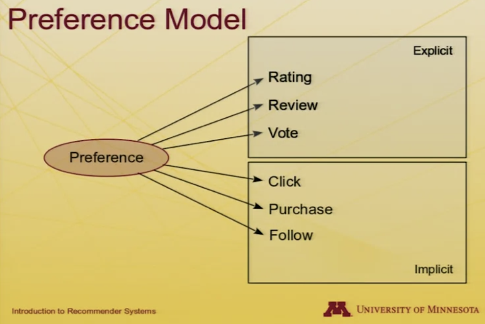

* 선호란?
  * 굉장히 폭넓게 사용하는 개념으로, 사용자의 개인화된 취향일 수도 있고, 사용자가 생각하는 잘 어울리는 상품일 수도 있음
  * 이후 수업에서 선호에 대한 심리학적인 부분에 대해서도 다룰 예정
  * 이번 수업에서는 사용자들이 자신의 선호에 대해서 알려주는 행위에 대해서 알아볼 것임
* 명시적 (Explicit)
  * 한 사용자가 어떤 서비스 또는 그 서비스의 다른 사용자들에게 특정 아이템에 대한 본인의 생각을 알려주기 위한 목적으로 행동을 취함
  * 점수 - 별점, 평점
  * 리뷰
  * 투표 - up-vote, down-vote
* 암묵적 (Implicit)
  * 선호를 알려주기 위한 목적으로 행동을 취하는 것은 아니지만 충분히 많은 행위를 통해 사용자의 취향의 일부는 파악할 수 있음
    * 계산이나 데이터 수집이 편리함
    * 행위가 확실하기는 한데 그 값들이 sparse 하게 나타남 - 구매한 물건은 구매하지 않은 물건보다 훨씬 적음
  * 클릭
  * 구매
  * 팔로우 (Follow)

### 명시적 평점 (Explicit Ratings)

* 사용자의 생각을 직접 물어보라!

#### 별점

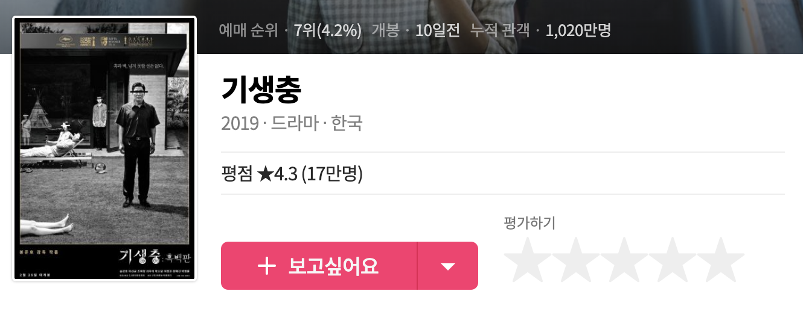

* 널리 사용하는 인터페이스
* 몇 가지 디자인적 결정
  * 5개, 7개, 10개?
  * 0.5점도 줄 것인지?
  * 의미/조정을 제공해줄 것인지? - `별 4개는 굉장히 드물게 좋은 영화다` 같은 별도의 코멘트 등
  * 더 자세한 것이 더 좋지만은 않음 - 보다 작은 단위로 조정할 수 있게 하면 원칙적으로는 좋을 수 있으며, 사용자들은 이러한 표현을 선호한다는 연구가 있지만, 추천 시스템에는 실질적인 이득이 없음
* 5개 만점으로 0.5점을 주거나 안 주거나 하는 것이 가장 일반적임
  * WATCHA: 5점 만점, 0.5점 단위로 조정
  * 네이버 영화: 10점 만점, 1점 단위로 조정 (별은 5개)
  * 다음 영화: 10점 만점, 1점 단위로 조정
  * IMDb: 10점 만점, 1점 단위로 조정
* 이에 대한 정답은 없음

#### 좋아요 (Thumbs and Likes)

* up/down 투표 - Pandora, StackoverFlow
* '좋아요' 나 '+1'
* 수명이 짧은 아이템들에게서 일반적: 영화는 오랜 시간이 지나도 보기는 하지만 아래의 사이트는 일반적으로 사용자들이 영상을 보고 떠나기 때문에 세부적인 평점을 매기지 않음
  * 뉴스 - Reddit, Digg
  * Q&A - StackOverflow
  * YouTube
* 평점을 매기는 것이 간단함

#### 다른 인터페이스

* 연속형 값
* 선호쌍 (Pairwise preference): 하나의 아이템을 특정 값 범위에서 선택하는 것이 아니라 둘 중 어떤 것을 좋아하는지 평가 (이상형 월드컵?)
* 하이브리드 (1-100점과 싫어요)
* 일시적 (Pandora - 30일 이내 재생 금지)

### 평점이 제공되는 경우

* 소비/사용 평점: 아이템을 사용하는 순간이나 경험한 직후. 경험 효과를 겪지 않아도 됨
* 기억 평점: 아이템을 경험하고 일정 시간이 지난 다음
* 기대 평점: 아이템을 사용해보지 않은 경우. 주택, 자동차, 아파트처럼 가격이 높고 그 숫자가 많지 않은 경우. 충분한 데이터를 얻기 위해서 기대 평점을 모으기도 함

### 허위 평점 (Joke rating)

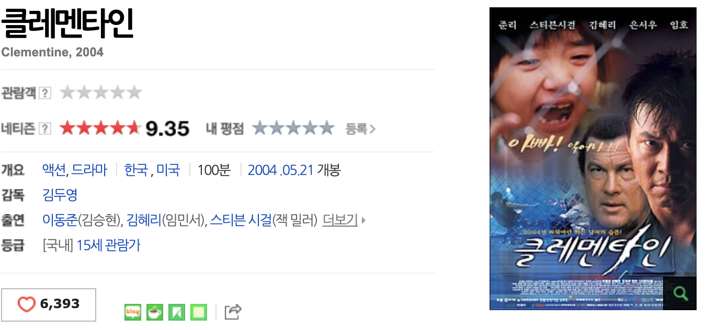

* 이상한 아이템을 보고 허위로 평점을 메기는 경우

### 평점의 어려움

* 평점이 믿을만하고 정확한가?
  * 어느 정도는 그렇지만 정확하지는 않음. 시간이 지나면 같은 영화에 대한 평점이 바뀌기도 함
* 사용자의 선호는 바뀌는가?
  * 일정 시간이 지나고 선호가 바뀌더라도 업데이트를 안 할 수도 있음
* 평점은 무엇을 의미하는가?

### 암묵적 데이터

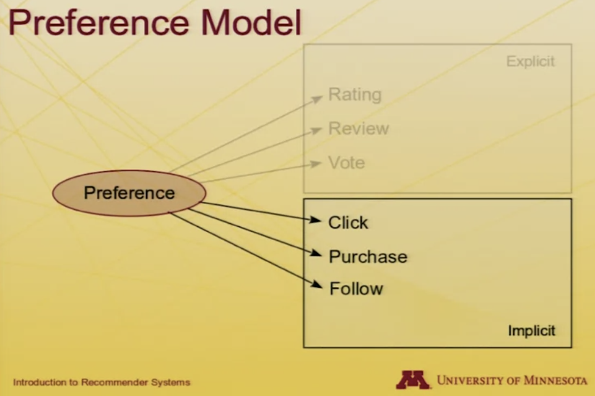

* 사용자가 서비스를 이용하면서 취하는 행위로부터 수집되는 데이터
  * 클릭한 뉴스, 구매한 아이템 등
* 주요 차이점: 사용자의 행위는 다른 목적을 위한 것이지 선호를 표현하기 위함이 아님
* 사용자의 행위는 많은 것을 말해줌

#### 읽는 시간

* 초기 암묵적 데이터: 사용자가 기사를 읽는데 보내는 시간은 얼마나 되는가?
* 청취 시간과 시청 시간
  * IMMS(Intelligent Music Management System): 사용자의 청취 기록을 추적하여 전체를 다 들으면 이를 기록하고, 건너뛰면 보다 선호할 것 같은 곡으로 찾아줌
  * 영상 서비스

#### 바이너리 액션

* 링크를 클릭하는 것: 광고, 결과, cross-reference
  * 검색 결과에서 세 번째 것을 클릭했다면 적어도 앞의 두 개는 일부 읽었다는 것을 알려줌
* 링크를 클릭하지 않는 것
* 구매: 사용자가 구매한 아이템을 좋아할 것으로 기대했다는 것을 알려줌
* 팔로우/친구맺기: 사람을 팔로우 하거나 특정 주제를 팔로우 함으로써 사용자가 흥미를 가지고 있는 것을 알려줌

### 미묘함과 어려움

* 행위가 의미하는 바는 무엇인가?
  * 구매: 구매를 했더라도 여전히 싫어할 수 있음
  * 클릭하지 않음: 싫어할 것이라고 기대했을 수도 있고, 못 봤을 수도 있음
* 행위를 비교/표현하는 방법은?
  * 0 또는 1
  * 클릭/시청/구매한 횟수
  * 여러 종류의 값을 같이 사용해서 추천을 할때에는 이를 표현하는 방법이 굉장히 중요
  * 경우에 따라 적절한 방법으로 조정이 필요
* 다양한 방법으로 소름끼치는 경우가 발생할 수도 있음: 사용자가 예상하지 않은 데이터를 사용할 수도 있고, 본인의 데이터를 사용하는 것을 원하지 않을 수도 있음
  * 교육을 통해 방지가 가능함: 사용자에게 그들의 데이터가 어떻게 사용되는지를 알려줄 수 있음
  * 개인정보를 존중함으로써도 가능함

### 결론

* 추천 시스템은 선호를 학습하기 위해 사용자가 *알려주는 것* 과 그들이 *취하는 행위* 를 살펴봄
* 평점은 선호에 대한 명시적인 표현을 제공
* 암묵적 데이터는 대량의 데이터에서 효과를 봄

## 예측과 추천

추천 시스템의 결과물

### 학습 목표

* 추천 시스템의 결과물이 사용되는 방법을 이해한다
* 예측과 추천의 차이를 이해한다
* 오가닉 (organic) 제시와 과 명시적 제시의 차이를 이해한다
* 사례를 살펴보고 다양한 어플리케이션에서 가장 납득할만한 제시 방법을 이해한다

### 예측

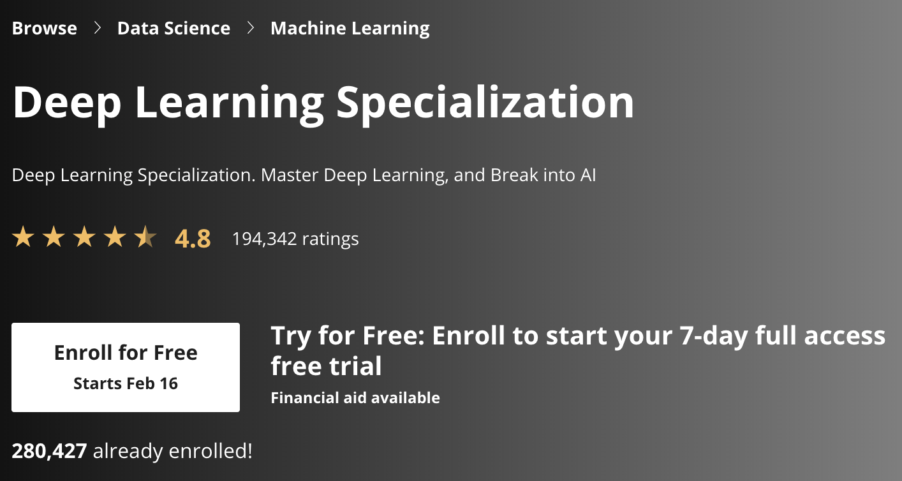

* 사용자가 아이템을 얼마나 좋아할지에 대한 예상
  * 평가 지표에 맞게 표현하기도 함
  * 특정 제품을 검색하거나 찾는 것과 관련되기도 함
  * 몇 명이나 해당 아이템과 관계를 맺었고(좋아요, 팔로우 등), 어떤 평가를 했는지 등을 보여주기도 함
  * 특정 키워드를 검색해서 그 결과를 여러 기준으로 정렬해서 그 안에서 찾아볼 수도 있음
* 아이템에 대한 사용자의 선호를 숫자로 보여주기 때문에 이를 제대로 예상하지 못했을 경우 사용자의 신뢰를 잃을 수도 있음

### 추천

* 추천은 사용자가 좋아할 수도 있는 (또는 사용자의 행위에 적합할 수도 있는)아이템을 제안하는 것
  * "Top-n 목록" 의 형태로 표현되기도 함
  * 또는 사용자 눈 앞에 보여주기도 함
* 구글 이미지 검색의 경우 사용자가 흥미로워할 수도 있는 결과물만을 보여주고, 사용자가 특정 이미지를 얼마나 좋아할지에 대해 평가를 하지는 않음

### 예측과 추천 비교

* 가끔 이 둘을 함께 사용하기도 함
* 사용자가 어떤 것을 구매하거나 소비하도록 하는 경우에는 서비스가 틀렸다고 말할 수 있는 기회를 주지 않는 것이 좋음

| | 장점 | 단점 |
| - | - | - |
| 예측 | 아이템을 수치화할 수 있음 | 속일 수 있는 (falsifiable) 정보를 제공 |
| 추천 | 좋은 선택을 기본적으로 제공 | 결과물을 top-n 으로 받아들이면 상위 결과물이 좋지 않을 경우 탐색의 기회를 상실 |

### 추가적인 고려 사항

* (오가닉에 비해) 예측이나 추천이 얼마나 더 명시적인가?
  * 과거: 우리가 산 추천 시스템이 뽑은 아이템들이야
  * 오늘: 명시적 예측 (속일 수 있음) 과 명확하지 않은 표현의 정도 (이걸 좋아할 수도 있어!) 사이의 적절한 밸런스
  * 오늘: 이것들이 최고 (top-n) 와 부드러운 제시 (흥미로워할 수 있는 것들) 사이의 밸런스
* 명시적 제시의 장점: 사용자가 이러한 예측이나 추천에 관심을 가지도록 할 수 있음
* 명시적 제시의 단점: 고객이 압박을 받거나 조종당하고 있다고 느낄 수 있음
* 오가닉 제시: 신상품을 잘 보이는 곳에 놓는 것처럼 서비스 제공자가 원하는 것을 보여주는 것

### 마치며

* 예측과 추천의 차이점을 이해했다
  * 예상 점수를 주는 것 vs 점수 없이 아이템을 보여주는 것
* 명시적인 것부터 오가닉까지의 예측과 추천에 대해 이해했다
  * 너한테 이 영화는 4.5/5점 짜리 영화야 vs 다른 사람들은 이게 4.5/5점짜리 영화래
  * 이게 제일 잘나가는 5가지 제품이야 vs 그냥 5가지 제품을 보여줄게
* 두 항목의 장점과 단점에 대해서 이해했다

## 추천 모델 분류 1

### 학습 목표

* 다양한 종류의 추천 시스템을 이해할 수 있다
  * 일반인 수준에서 추천 시스템을 분석하는 프레임워크
  * 다양한 추천 알고리즘에 대한 구체적인 개괄
* 학습한 알고리즘에 기반하여 나머지 수업에 대한 로드맵을 그릴 수 있다

### 분석 프레임워크

* 분석의 차원
  * 도메인
  * 목적
  * 추천 맥락
  * 누구의 의견인가
  * 개인화 수준
  * 인터페이스
  * 추천 알고리즘

### 추천의 도메인

* 컨텐츠에서 커머스, 그리고 그 이상: 어떤 것을 추천하는가?
  * 뉴스, 정보, "글"
  * 제품, 판매자, 묶음 상품
  * 관계 맺기 (다른 사람들)
  * 순서 (음악 플레이리스트 등)
* 특히 흥미로운 한 가지 특징
  * 새로운 아이템 (영화, 책 등)
  * 오래된 것 재추천하기 (식료품, 음악 등)
    * 식료품의 경우 한 번도 먹어보지 못한 것을 추천하기 보다는 자주 먹는 것을 추천하는 것이 일반적인데 익숙한 것을 주로 사기 때문

### 추천의 목적

* 추천 그 자체
  * 판매
  * 정보
* 사용자/고객의 교육
* 제품이나 컨텐츠에 대한 사용자/고객 커뮤니티 형성
  * 트립어드바이저: 사이트를 통해 예약을 해주면 좋지만 이들이 원하는 것은 사용자 리뷰들로 커뮤니티를 만드는 것

### ReferralWeb

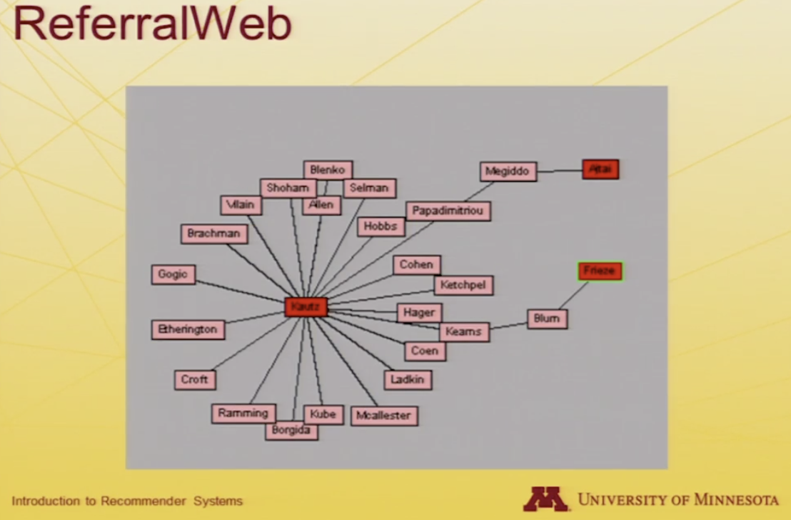

* 특정 키워드를 통해 연구자들을 엮어줌

### 추천의 맥락 (Recommendation Context)

* 추천 당시에 사용자는 어떤 행위를 하고 있었는가?
  * 쇼핑
  * 음악 감상: 음악 감상 중일 때에 곡이 끝날 때마다 대화 상자가 열려서 다음 노래를 추천해준다면 빡침
  * 친목 모임: 혼자 노는 게 아니라 여럿이서 노는 걸 추천시스템이 안다면 여럿이서 할 수 있는 것을 추천해줄 것임
* 맥락이 추천 시스템을 제한하는 방법은 무엇인가?
  * 그룹, 자동적인 소비 (vs 제안), 주목의 수준, 개입의 수준?
  * 판도라: 여러가지 행위를 할 수 있도록 기능은 제공해주지만 일반적으로는 (광고를 제외하면) 계속 노래만 틀어줌

### 누구의 의견인가?

* 넓게 보면 추천시스템은 **누군가의 의견** 이라고 할 수 있음
* "전문가": 와인 추천사이트
* 평함한 "사람들(phoaks; folks)": PHOAKS(People Heling One Another Know Stuff) 처럼 일반적인 사람들이 서로를 돕는 뉴스 그룹
* 비슷한 사람들

### 개인화 수준

* 포괄적 / 비개인화
  * 모든 사람이 동일한 추천을 받음: Top 100, Most Popular
* 인구통계적
  * 특정 그룹에 맞춰서 추천: 성별, 연령대 등에 따라서
* 수명이 짧은 (ephemeral)
  * 현재 행동에 맞춰서 추천: 현재 보고 있는 상품과 같이 구매하는 상품 추천
* 지속적인
  * 장기적인 흥미에 맞춰서 추천

### 개인정보와 신뢰

* 내 정보를 아는 사람은 누구인가?
  * 개인 정보
  * 개인 식별
  * 취향을 거부할 수 있는 기능
* 추천이 정직한가?
  * 기능을 운영하는 사람에 의해 만들어진 편향
    * "비즈니스 규칙": 수익이 되지 않는 것은 추천하지 않는다
  * 외부 조작에 대한 취약성
    * 무비렌즈의 경우 영화 개봉일에는 항상 점수가 높음 -> 사용자가 해킹에 대해 의심하기도 함
  * "추천 시스템" 의 투명성; 명성

### 인터페이스

* 결과물의 종류
  * 예측: 특정 점수
  * 추천: 여러 아이템을 보여줌
  * 필터링: 검색 결과에서 일부를 걸러서 보여주는 경우
  * 오가닉 vs 명시적 제시
    * 어떤 에이전트가 도와주는 것처럼 보여주는가: 챗봇 이나 MS Office 의 강아지 느낌?
    * 결과에 대해 비판을 할 수 있는 토론 형태인가
    * 검색엔진이나 검색도구 형태인가
* 입력값의 종류
  * 명시적: 어떤 아이템을 좋아했고, 얼마나 좋아했는지 알려주는가
  * 암묵적: 구매나 방문 빈도만 알려주는가

### 추천 알고리즘 (이어서 계속)

* 비개인화 요약 통계량
* 컨텐츠 기반 필터링
  * 정보 필터링
  * 지식 기반
* 협업 필터링
  * 사용자-사용자
  * 아이템-아이템
  * 차원 축소
* 기타
  * 비평 / 인터뷰 기반 추천
  * 하이브리드 기법

## 추천 모델 분류 2

### 추천 알고리즘

* 비개인화 요약 통계량
* 컨텐츠 기반 필터링
  * 정보 필터링
  * 지식 기반
* 협업 필터링
  * 사용자-사용자
  * 아이템-아이템
  * 차원 축소
* 기타
  * 비평 / 인터뷰 기반 추천
  * 하이브리드 기법

### 추상적인 것에서 구체적인 것으로

* 기본 모델: 모든 추천시스템이 가지고 있는 세 가지 개념
  * 사용자: 서비스를 사용하고 아이템에 대한 선호도를 매기고, 협업 추천을 하는 경우 데이터를 제공해주는 개인
  * 아이템: 추천 시스템이 추천하고자 하는 것
  * 평점: 서비스에서 선호도를 표현하는 방법
  * (커뮤니티): 이러한 의견이 이치에 맞다고 여겨지는 공간

### 연결하기

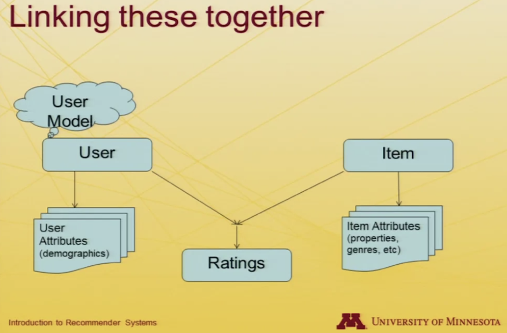

* 사용자: 사용자의 특성을 가지고 있을 수 있음
  * 가장 쉽게 생각할 수 있는 것은 연령이나 성별, 사는 지역 등의 인구통계 정보
* 사용자 모델 (User model)
  * 좋아하는 영화의 장르나 선호하는 책의 종류 등
* 아이템 (Item): 아이템 자체에 대한 속성
  * 영화의 장르, 영화에 나온 배우, 감독, 책의 종류, 책의 저자 등이 해당
* 평점: 사용자와 아이템이 만나는 공간
  * 사용자가 특정 아이템을 좋아한다
  * 사용자가 특정 아이템에 어떤 점수를 매겼다
  * 사용자가 특정 아이템을 구매했다

### 비개인화 요약 통계

* 주로 요약 통계이며 가끔 product association 을 포함하기도 함
* 외부 커뮤니티 데이터
  * Best-seller, Most popular, trending hot
* 커뮤니티 평가의 요약
  * Best-liked: 몇 명이나 좋아했는지 등에 대한 정보
* 예
  * Zagat 레스토랑 평점
  * 빌보드 음악 랭킹
  * TripAdvisor 호텔 평점/리스트

## Amazon.com 돌아보기

## 추천 시스템의 과거와 현재, 그리고 미래

## 1주차 정리

* 알고리즘
  * 컨텐츠기반 필터링
    * 정보 필터링:
    * 지식 필터링: 약간은 수동
  * 협업 필터링
    * 사용자-사용자
    * 아이템-아이템
    * 차원 축소: 데이터가 많아지기 때문에 이를 잘 하는 것이 성능에 큰 영향을 끼침
  * 기타
    * 리뷰/인터뷰 기반 추천
    * 하이브리드
* 추천 모델
  * Input
    * 사용자가 아이템에 대해서 평가를 한 것을 수집
    * 사용자에 대한 정보를 수집
    * 아이템에 대한 정보를 수집
* 비개인화 요약통계
  * 외부 커뮤니티 데이터: 베스트셀러, Top 100, Trending hot, ...
  * 커뮤니티 평가: 서비스 사용자의 평가 등
* 개인화 협업 필터링
  * 사용자 모델: 평점
    * 비슷한 사람들이 산 것, word-of-mouth(입소문)
    * SNS 를 가지고 와서 친구가 산 걸 보여주면 어떻겠냐?
  * 아이템 모델: 평점
    * 이 카테고리에서 평점이 비슷한 아이템들
  * 차원 축소
    * dimension 을 늘리다 보면 연산량이 많아지기 때문에 이를 잘 조절하는 것도 능력
  * 거리가 가장 가까운 사용자의 사용/구매 내역 같은 걸 추천
    * 값을 보여주면 prediction
    * 여러 아이템을 보여주면 recommendation
* 평가
  * 예측의 정확도
  * 추천시스템의 유용성
    * 제대로 됐는지
    * 명백한 것만 보여주지는 않았는지
    * 다양성
  * 계산 성능