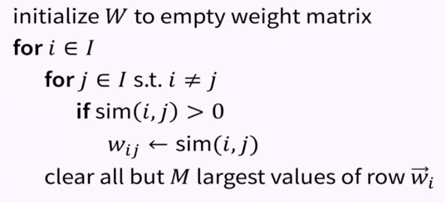
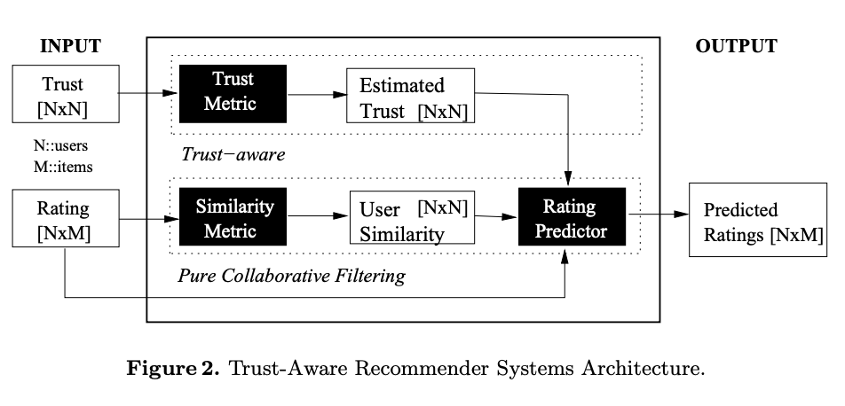

# Item-Item Collaborative Filtering Recommendation

## Introduction to Item-Item Collaborative Filtering

### Motivation

* User-User CF 도 잘 작동하긴 하지만, ...
* Sparcity 문제
  * 큰 아이템 집합과 더 큰 사용자 집합이 있는 경우에는 평점 수가 적어지고, 추천이 불가능한 경우가 빈번히 발생
  * 이를 해결하기 위한 다양한 방법이 존재: filterbot, item-item, 차원 축소 (dimensionality reduction)
* 계산 성능
  * 수백만(또는 그 이상) 명의 사용자가 있는 경우 모든 쌍의 상관관계를 계산하는 것은 연산 비용이 비쌈
  * 점진적으로 갱신해나가는 방법조차도 비쌈
  * 그리고 사용자 프로파일이 빠르가 바뀔 수 있음
  
### The Item-Item Insight

* Item-Item 유사도는 비교적 안정적임
  * 아이템 유사도: 특징에 기반한 유사도가 아님. 사용자의 선호에 대한 유사성으로, 한 아이템을 좋아한 또는 구매한 사용자가 다른 아이템도 좋아하는가.
  * 특히 아이템의 개수보다 사용자의 숫자가 훨씬 많은 경우
* 아이템 유사도는 사용자의 아이템 선호에 대한 예측을 계산하는 방법

### A little more detail

* Two step process:
  * 아이템 쌍들 사이의 유사도를 계산
    * 평점 벡터들의 상관관계, 아이템 평점 벡터들의 코사인 (Cosine), 조건부 확률
  * user-item 평점 예측: 사용자가 사전에 평가한 아이템을 안다면, 이것들을 고려할 확률이 높으며, 다음에 고려하는 것들을 예측하는 데에 사용하기 좋을 것이라는 데에 기반함

### Item-Item Top-N

* Item-Iteam 유사도 모형은 top-N 을 직접적으로 계산하는데에 사용할 수 있음
  * k 개의 가장 유사한 아이템으로 이루어진 작은 "이웃" 들로 아이템을 제한함으로써 모형을 간소화할 수 있음
  * 아이템의 프로파일 집합을 구할 때, 각각의 프로파일 아이템에 대해 k개의 가장 유사한 아이템들을 계산 / 병합 / 정렬

### Core Assumptions / Limitations

* Item-Item 관계가 안정적이어야함
  * 대부분은 안정적인 사용자 선호에 따라오는 가정
  * 적용이 어려운 경우가 있을 수 있음 (예: 달력, 수명이 짧은 책 등)
  * 이러한 문제의 많은 경우가 일반적으로 시계열적인 문제
* 주된 제약 / 컴플레인: 우연한 발견을 할 가능성이 낮음
  * 이는 사용자 / 연구자의 불평으로 깊게 연구된 것은 없지만 직관적으로 맞는 말

## Item-Item Algorithm

### User-User algorithm

$s(u, i) = \frac{\sum_{v \in} w_{uv}(r_{vi} - \bar{r}_v)}{\sum_{v \in V}w_{uv}} + \bar{r}_u$

### Formula of Item-Item CF

$s(u, i) = \frac{\sum_{j \in N}w_{ij}r_{uj}}{\sum_{j \in N} |w_{ij}|}$

* $i$: 아이템
* $j$: $N$ 개의 이웃 아이템 집합에 있는 아이템
* $w_{ij}$: 아이템 $i$ 와 아이템 $j$ 사이의 가중치 (상관관계, 코사인 유사도 등)
* $r_{uj}$: 아이템 $j$ 에 대한 사용자 $u$ 의 평점

### Normalization

* $s(i; u) = \frac{\sum_{j \in N(i; u)} w_{ij}(r_{uj} - \bar{r}_j)}{\sum_{j \in N(i; u)}| w_{ij}|} + \bar{r}_i$

### Model Building Algorithm

## Item-Item Hybrids and Extensions

### Example: User Trust

* 목표: 아이템 연관성 연산에 사용자의 신뢰도를 접목하기 (한 사용자에 대한 다른 사용자들의 신뢰도는 모두 동일)
* 방법: 아이템 유사도를 계산하기 전에 사용자의 신뢰도로 가중치를 줌
* 신뢰도가 높은 사용자가 더 큰 영향을 가짐
* $w_{ij} = \frac{\sum_u \rho_u\hat{r}_{ui} \hat{r}_{uj}}{\sqrt{\sum_u \rho_u \hat{r}_{uj}^2} \sqrt{\sum_u \rho_u \hat{r}_{uj}^2}}$

### Extension: Papers and PageRank

* 논문 추천: useful to consider items as users who purchase the paper's citations
* 목표: 추천 시스템에 논문의 '중요도' 접목하기
* 방법: 논문 사용자 벡터에 논문의 PageRank(or HITS hub score) 로 가중치 적용

### Restructuring: Item-Item CBF

* 기본적인 Item-Item 알고리즘은 유사도의 계산 방법에 무관함
* 컨텐츠 기반 유사도를 사용하지 못하는 이유도 없음
* 결과적으로는 협업 필터링은 아니지만 잘 작동함
* 예시: Lucene 을 사용해서 이웃과 유사도 함수로 문서 비교하기

### Restructuring: Deriving Weights

* Item-Item 은 개별의 아이템 쌍을 비교함
* 대안: 데이터로부터 계수 추론하기
  * 제곱오차를 최소화하는 계수 $w_{ij}$ 찾기
  * 일반적인 머신러닝/최적화 알고리즘(gradient descent) 방법으로 계수 학습하기

## Strengths and Weaknesses of Item-Item CF

### 장점

* 사용자의 숫자가 아이템의 숫자보다 월등히 많은 경우 미리 계산을 해놓을 수 있기 때문에 User-User 보다 효율적

### 단점

* 과감한 예측이나 추천이 없어서 결과가 뻔할 수 있음

### Two Intuitions

* Item-Item 은 User-User 보다 효율적이다
  * 사용자의 숫자가 아이템의 숫자보다 월등히 많은 경우
* Item-Item 은 총합적인(aggregated) 제품 연관 추천 시스템이다

### What happened

* 아마존은 Item-Item 알고리즘을 넓게 사용함
  * 추천에서 큰 성공을 거두었고, 사용자들이 흥미있는 아이템을 찾는데에 도움을 줌
* MovieLens 에서는 불만이 많아짐
  * 추천이 너무 뻔하다
  * 과감한 추천이나 예측이 없다
* Item-Item 은 User-User 와 동일하지 않음
  * Item-Item 알고리즘에서는 굉장히 다른 아이템들을 찾아서 추천하는 것이 매우 어려움
  * User-User 에서는 기본적으로 매우 가까운 이웃이 좋아하는 아이템을 큰 근거가 없더라도 높게 평가함
  * Item-Item 예측은 덜 극단적임 (더 많은 데이터에 기반을 하고 있기 때문에)

### Reference

* [Item-based collaboriatve filtering recommendation algorithms: Badrul Sarwar, George Karypis, Joseph Konstan, and John Riedl, 2001](http://files.grouplens.org/papers/www10_sarwar.pdf)
* [Item-based top-N recommendation algorithm, Mukund Deshpande and George Karypis, 2004](http://glaros.dtc.umn.edu/gkhome/node/127)
* [Trust-Aware Collaborative Filtering for Recommendation Systems, Massa and Avesani, 2004](https://link.springer.com/chapter/10.1007/978-3-540-30468-5_31)
* [Automatically Building Research Reading Lists, Ekstrand, et al., 2010](https://md.ekstrandom.net/pubs/reading-lists.pdf)
