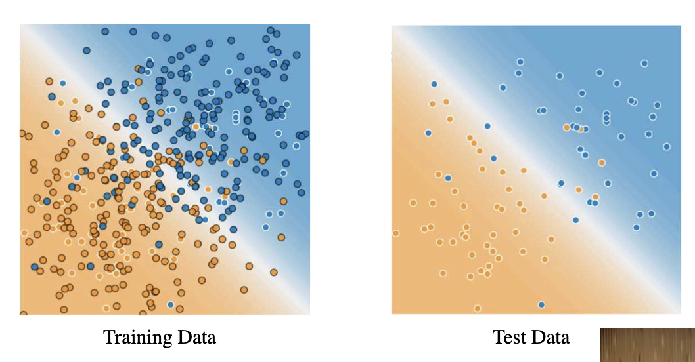

# Training and Test Sets

---

## Partitioning data sets

* Devide the large data set into two smaller sets and use one for training the model and use the other set to evaluate the model
* Make sure to suffle the data before spliting and keep them seperate so that we do not use test set for training by accident

---

## Train evaluation vs test evaluation

* The larger we make our trianing set, the better model we're going to be able to learn
* The larger we make our test set, the better we'll be confident in our evaluation metrics, we'll have tighter confident intervals

---

## What if we only have one data set

* Devide into two sets
  * training set: a subset to train a model
  * test set: a subset to test the trained model
* Make sure that your test set meets the following conditions
  * Is large enough to yield statistically meaningful results
  * Is representative of the data set as a whole. In other words, don't pick a test set with different characteristics than the training set.
* Classic gotcha: **dot not train on test data**
  * Getting surprisingly low loss?
  * Before celebrating, check if you're accidentally training on test data
