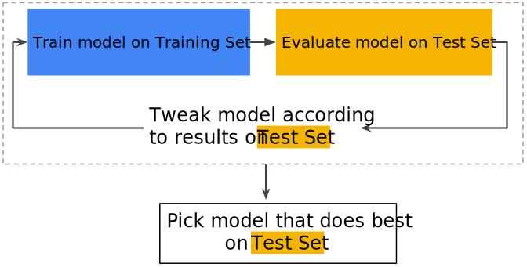

# Validation Set

---

## A possible workflow (1)

---

## A possible workflow (2)

* Downside for this approach is that the model could be over-fitted to the peculiarities of the test data

---

## Partitioning data sets

* Instead of splitting the data into two sets, now split the data into three sets: training, validation, and test sets
* This way, we can prevent the model to be over-fitted to the test data

---

## Better workflowL Use a validation set (1)

---

## Better workflowL Use a validation set (2)

1. Do iterations by training on training data, then evaluating only on the validation data
2. Keeping the test data way off to the side and completely unused
3. Iterate and iterate, tweaking parameters or making changes to the model until getting very good result on the validation data
4. And then, only then, test the model on the final test data
5. Make sure that the reuslts getting on the test data basically match the result from the validation data
   * If not, it's a pretty good signal that the model was over-fitted to the validation set

---

## Programming exercise

[Validation programming exercise](https://colab.research.google.com/notebooks/mlcc/validation.ipynb?utm_source=mlcc&utm_campaign=colab-external&utm_medium=referral&utm_content=validation-colab&hl=en)
