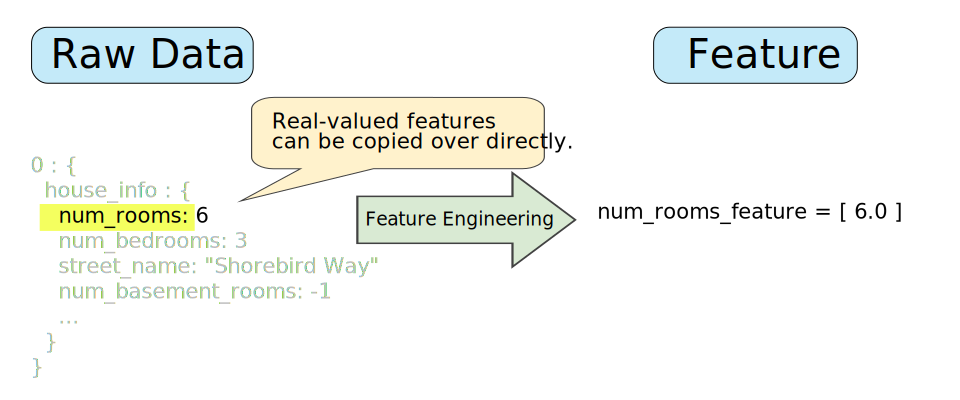
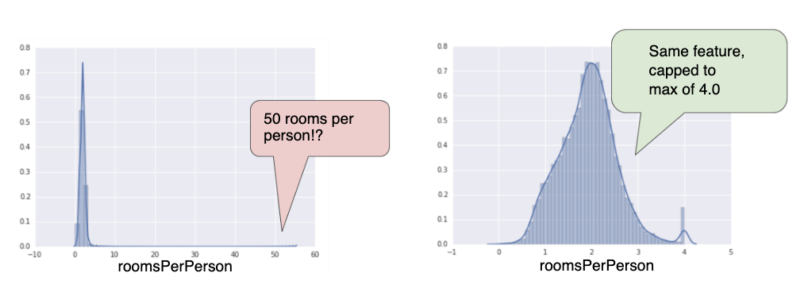

# Representation

---

## From raw data to features (1)

The idea is to map each part of the vector on the left into one or more fields into the feature vector on the right

---

## From raw data to features (2) - Mapping numerical values

Mapping numerical values is easy

---

## From raw data to features (3) - Mapping categorical values

Mapping categorical values requires a bit more sophisticated feature engineering tricks

* Dictionary maps each street name to an `int` in {0, ..., V-1}
* Now represent one-hot vector above as *`<i>`*

---

## Properties of a good feature (1)

### Feature values should appear with non-zero value more than a small handful of times in the dataset

* Good - device_model : galaxy_s6
* Bad - my_device_id : 8SK982ZZ1242Z

---

## Properties of a good feature (2)

### Features should have a clear, obvious meanings

* Good - user_age : 23 (in years)
* Bad - user_age : 12345678 (in UNIX epoch)

---

## Properties of a good feature (3)

### Features should not take on 'magic' values

* Good - watch_time : 1.023
* Bad - watch_time : -1.0
* Use an additional boolean feature like is_watch_time_defined instead
  * Good - watch_time_is_defined: 1 / true

---

## Properties of a good feature (4)

### The definition of a feature should not change over time

* Beware of depending on other ML systems
* Good - city_id : 'br/sao_paulo'
* Bad - inferred_city_cluster_id : 219

---

## Properties of a good feature (5)

### Distribution should not have extreme outliers

* Ideally all features transformed to a similar range, like (-1, 1), or (0, 5)

---

## The binning trick

* Create several boolean bins, each mapping to ta new unique feature
* Allows model to fit a different value for each bin

---

## Scrubbing

In real-life, many examples in data set are unreliable due to one or more of the fowllowing:

* **Omitted values**: For instance, a person forgot to enter a value for a house's age
* **Duplicate examples**: For example, a server istakenly uploaded the same logs twice
* **Bad labels**: For instance, a person mislabeled a picture of an oak tree as a maple
* **Bad feature values**: For example, someone typed in an extra digit, or a thermometer was left out in the sun

---

## Good habits

### Know your data

* **Visualize**: Plot histograms, rank most to least common
* **Debug**: Duplicate examples? Missing values? Outliers? Data agrees with dashboards? Traning and validation data similar?
* **Monitor**: Feature quantiles, number examples over time?

---

## Programming exercise

[Feature Sets programming exercise](https://colab.research.google.com/notebooks/mlcc/feature_sets.ipynb?utm_source=mlcc&utm_campaign=colab-external&utm_medium=referral&utm_content=featuresets-colab&hl=en)
