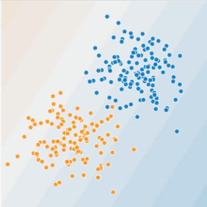
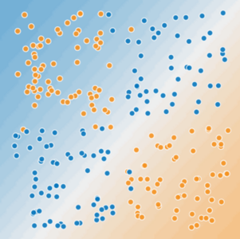

# Feature Crosses

* A **feature cross** is a **synthetic feature** formed by multiplying (crossing) two or more features. Crossing combinations of features can provide predictive abilities beyond what those features can provide individually.

---

## Example (1)

### Figure 1. Is this a linear problem



* Here, we can draw a line that separates oragne and blue dots easily.

---

## Example (2)



* Here, there's no single line that separates orange and blue dots.
* That's when the feature cross is required.

---

## Example (3): Solution

Let's create a feature cross named $x_3$

* $x_3 = x_1 \times x_2$

Then the new linear formula will be

* $y = b + w_1x_1 + w_2x_2 + w_3x_3$

A linear algorithm can learn a weight for $w_3$ just as it would for $w_1$ and $w_2$. In other words, although $w_3$ encodes nonlinear information, you don't need to change how the linear model trains to determin the value of $w_3$

---

## Feature Crosses explained

* **Feature crosses** is the name of this approach
* Define templates of the form `[A x B]`
* Can be complex: `[A x B x C x D x E]`
* When `A` and `B` represent boolean features, such as bins, the resulting crosses can be extremely sparse

---

## Some Examples

### Housing market price predictor:

* `[latitude x num_bedrooms]`

### Tic-Tac-Toe predictor:

* `[pos1 x pos2 x ... x pos9]`

---

## Why would we do this

* Linear learners use linear models
* Such learners scale well to massive data e.g., Vowpal Wabbit, sofia-ml
* But without feature crosses, the expressivity of these models whould be limited
* Using feature crosses + massive data is one efficient strategy for learning highly complex models
  * Foreshadowing: neural nets provide another

---

## Crossing One-Hot Vectors (1)

Suppose you bin latitude and longitude, producing separate one-hot five-element feature vectors

```python
binned_latitude = [0, 0, 0, 1, 0]
binned_longitude = [0, 1, 0, 0, 0]
```

Suppose we created a feature corss of these two feature vectors:

```python
binned_latitude x binned_longitude
```

---

## Crossing One-Hot Vectors (2)

Suppose we bin latitude and longitude more coarsely, as follows:

```python
binned_latitude(lat) = [
  0  < lat <= 10
  10 < lat <= 20
  20 < lat <= 30
]

binned_longitude(lon) = [
  0  < lon <= 15
  15 < lon <= 30
]
```

---

## Crossing One-Hot Vectors

The feature cross of `binned_latitude x binned_longitude` would be like:

```python
binned_latitude_X_longitude(lat, lon) = [
  0  < lat <= 10 AND 0  < lon <= 15
  0  < lat <= 10 AND 15 < lon <= 30
  10 < lat <= 20 AND 0  < lon <= 15
  10 < lat <= 20 AND 15 < lon <= 30
  20 < lat <= 30 AND 0  < lon <= 15
  20 < lat <= 30 AND 15 < lon <= 30
]
```

So the position in the vector tells the combination of `binned_latitude` and `binned_longitude`

---

## Programming exercise

[Feature Crosses programming exercise](https://colab.research.google.com/notebooks/mlcc/feature_crosses.ipynb?utm_source=mlcc&utm_campaign=colab-external&utm_medium=referral&utm_content=featurecrosses-colab&hl=en)
