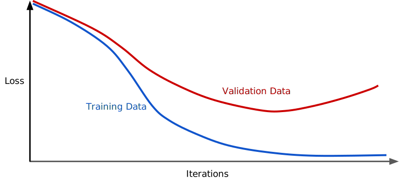
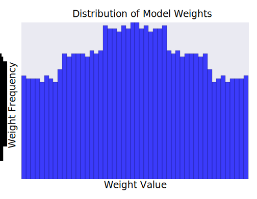

# Regularization for Simplicity

**Regularization** means penalizing the complexity of a model to reduce overfitting.

---

## Generalization Curve

* As the training iteration increses the training loss is getting smaller.
* However, the validation loss starts to increase at some point
* This indicates that the model starts to overfit to the training data at some point.

---

## Penalizing Model Complexity

* We want to avoid model complexity where possible.
* We can bake this idea into the optimization we do at training time.
* Empirical Risk Minimization
  * aims for low training error
    * $minimize: Loss(Data|Model)$
  * while balancing agains complexity
    * $minimize: Loss(Data|Model) + complexity(Model)$

---

## Regularization

### How to define $complexity(Model)$

* Prefer smaller weights
* Diverging from this should incur a cost
* Can encode this idea via $L_2$ **regularization** (a.k.a ridge)
  * $complexity(Model)$ = sum of the squares of the weights
  * Penalizes really big weights
  * For linear models: prefers flatter slopes
  * Bayesian prior:
    * weights should be centered around zero
    * weights should be normally distributed

---

## A Loss Function with $L_2$ Regularization

$Loss(Data|Model) + \lambda (w_1^2 + ... + w_n^2)$

Where:

* $Loss$: Aims for low training error
* $\lambda$: Scalar value that controls how weights are balanced
* $w_1^2 + ... + w_n^2$: Squares of $L_2$ norm

---

## Lambda

Performing $L_2$ regularization has the following effect on a model

* Encourages weight values toward 0 (but not exactly 0)
* Encourages the mean of the weights toward 0, with a normal (bell-shaped or Gaussian) distribution

When choosing a lambda value, the goal is to strike the right balance between simplicity and training-data fit:

* If your lambda value is too high, your model will be simple, but you run the risk of *underfitting*.
* If your lambda value is too low, you model will be more complex, and you run the risk of *overfitting*. Your model will learn too much about the particularities of the training data, and won't be able to generalize to new data.

---

## Histogram of weights produced

high value | low value
------------|-----------
 | 
