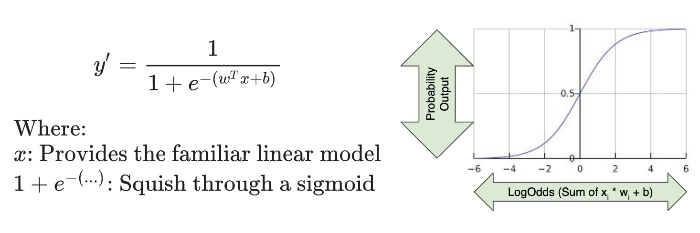

# Logistic Regression

Instead of predicting *exactly* 0 or 1, **logistic regression** generates a probability - a value *between* 0 and 1, exclusive.

---

## Predicting Coin Flips

* Imagine the problem of predicting probability of Heads for bent coins
* You might use feagures like angle of bend, coin mass, etc.
* What's the simplest model you could use? - linear model
* What could go wrong? - the output range is not set between 0 and 1 (the definition of probability)

---

## Logistic Regression explained

* Many problems require a probability estimate as output
* Enter **Logistic Regression**
* Handy because the probability estimates are **calibrated**
  * for example p(house will sell) x price = expected  outcome
* Also useful for when we need a binary classification
  * spam or not spam? -> p(Spam)

---

## Predictions

---

## LogLoss Defined

$LogLoss = \sum_{(x, y) \in D} -y(log(y') - (1-y) log(1-y')$

---

## Logistic Regression and Regularization

* Regularization is super important for logistic regression
  * Remember the asymptotes
  * It will keep trying to drive loss to 0 in high dimensions
* Two strategies are especially useful:
  * **$L_2$ regularization** (a.k.a $L_2$ wiehgt decay) - penalizes huge weights
  * **Early stopping** - limiting training steps or learning rate

---

## Linear Logistic Regression

* Linear logistic regression is extremely efficient
  * Very fast training and prediction times
  * Short / wide models use a lot of RAM
