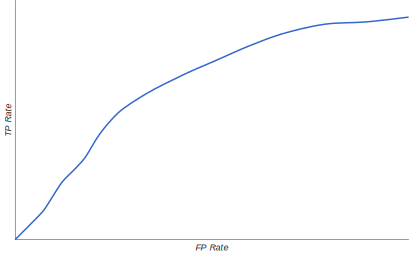

# Classification

---

## Classification vs Regression

* Sometimes, we use logistic regression for the probability outpus - this is a regression in (0, 1)
* Other times, we will threshold the value for a discrete binary classification
* Choice of threshold is an important choice, and can be tuned

---

## Evaluation Metrics: Accuracy

### How do we evaluate classification models?

* One possible measure: Accuracy
  * the fraction of predictions we got right

---

## Accuracy Can Be Misleading

## In many cases, accuracy is a poor or misleading metric

* Most often when different kinds of mistakes have different costs
* Typical case includes *class imbalance*, when positive or negatives are extremly rare

---

## True Positives and False Positives

### For class-imbalanced problems, useful to separate out different kinds of errors

| | |
--|--|
**True Positives**   We correctly called wolf!   We saved the town | **False Positives**   Error: we called wolf falsely   Everyone is mad as us |
| **False Negatives**   There was a wolf, but we didn't spot it   It ate alll our chickens | **True Negatives**   No wolf, no alarm   Everyone is fine |

---

## Evaluation Metrics: Precision and Recall

### Precision: (True Positives) / (All Positive Predictions)

* When model said "positive" class, was it right?
* Intuition: Did the model cry "wolf" too often?

### Recall: (True Positive) / (All Actual Positives)

* Out of all the possible positives, how many did the model correctly identify?
* Intuition: Did it miss any wolves?

---

## A ROC Curve

### Each poin is the TP and FP rate at one decision threshold

---

## Evaluation Metrcis: AUC

### AUC: Area under the ROC Curve

* Interpretation
  * If we pick a random positive and a random negative, what's the probability my model ranks them in the correct order?
* Intuition: gives an aggregate measure of performance aggregated across all possible classification thresholds

---

## Prediction Bias

* Logistic Regression predictions should be unbiased
  * average of predictions == average of observations
* Bias is a canary
  * Zero bias alone does not mean everything in your system is perfect
  * But it's a greate sanity check
* If you have bias, you have a problem
  * Incomplete feature set?
  * Buggy pipeline?
  * Biased training sample?
* Don't fix bias with a calibration layer, fix it in the model
* Look for bias in sclices of data - this can guide improvements

---

## Calibration Plots Show Bucketed Bias

---

## Thresholding

Logistic regression returns a probability. You can use the returned probability "as is" or convert it to a bianary value.

In order to map a logistic regression value to a binary category, you must define a **classification threshold** (also called the **decision threshold**).

"Tuning" a threshold for logistic regression is different from tuing hyperparameters such as learning rate. Part of choosing a threshold is assessing how much you'll suffer for making a mistake.

---

## True vs False and Positive vs Negative

A **true positive** is an outcome where the model *correctly* predicts the *positive* class. Similarly, a **true negative** is an outcome where the model *correcly* predicts the *negative* class.

A **false positive** is an outcome where the model *incorrectly* predicts the *positive* class. And a **false negative** is an outcome where the model *incorrectly* predicts the *negative* class.

---

## Accuracy

Accuracy is one metric for evaluating classification models. Informally, **accuracy** is the fraction of predictions out model got right. Formally, accuracy has the following definition:

$Accuracy = \frac{Number\ of\ correct\ predictions}{Total\ number\ of\ predictions}$

For binary classification, acccuracy can also be caclulated in terms of positives and negatives as follows:

$Accuracy = \frac{TP + TN}{TP + TN + FP + FN}$

Accuracy alone doesn't tell the full stroy when you're working with a **class-imbalanced data set** where there is a significant disparity between the number of positive and negative labels.

---

## Precision and Recall

### Precision

**Precision** attemps to answer the following question:

`What proportion of positive identifications was actually correct?`

$Precision = \frac{TP}{TP + FP}$

### Recall

**Recall** attemps to answer the following question:

`What proportion of actual positive was identified correctly`

$Recall = \frac{TP}{TP + FN}$

---

## ROC Curve (1)

An **ROC curve**(receiver operating characteristic curve) is a graph showing the performance of a classification model at all classification threshold. This curve plots two parameters:

* True Positive Rate: $TPR = \frac{TP}{TP + FN}$
* False Positive Rate: $FPR = \frac{FP}{FP + TN}$

---

## ROC Curve (2)

---

## AUC (1)

**AUC** stands for "Area under the ROC Curve" That is, AUC measures the entire two-dimensional area underneath the entire ROC curve from (0, 0) to (1, 1)

AUC is desirable for the following two reasons:

* AUC is **scale-invariant**. It measures how well predictions are ranked, rather than their absolute values
* AUC is **classification-threshold-invariant**. It measures the quality of the model's predictions irrespective of what classification threshold is chosen.

However, both these reasons come with caveats, which may limit the usefulness of AUC in certain use cases:

* **Scale invariant** is not alwasy desirable
* **Classification-threshold-invariant** is not always desirable.

---

## AUC (2)

---

## Prediction Bias

**Prediction bias** is a quantity that measures how far apart the average of predictions and average of observations are. That is:

`prediction bias = average of predictions - average of labels in data set`

---

## Programming exercise

[Logistic Regression programming exercise](https://colab.research.google.com/notebooks/mlcc/logistic_regression.ipynb?utm_source=mlcc&utm_campaign=colab-external&utm_medium=referral&utm_content=logisticregression-colab&hl=en)
