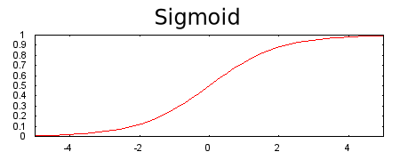

# Neural Networks

---

## A Linear Model

* We have a number of inputs, each with a weight that's combined linearly, to produce an output.
* If we want to get a non-linearity in there, maybe we need to have an additional layer in there

---

## Add Complexity: Non-Linear?

* We can add the inputs in a nice linear combination, into a second layer.
* That second layer gets linearly combined and we haven't yet achieved any non-linearity. Because a linear combination of linear functions is still linear.

---

## More Complex: Non-linear?

* Any linear combinations of linear functions is still linear

---

## Adding a Non-linearity

---

## Our Favorite Non-Linearity

* **ReLU** takes a linear function, and chops it off at zero
* This is the simplest possible non-linear function, and this allows us to create non-linear models

---

## Neural Nets Can Be Arbitraritly Complex

* When we train these neural nets, obviously we are in a non-convex optimization, so initialization may matter.
* We are going to use a variant of gradient descent, called back propagation to train these. Back propagation essentially allows us to do gradient descent in this non-convex optimization in a reasonably efficient manner

---

## Activation Functions

### Sigmoid

$F(x) = \frac{1}{1 + \exp^{-x}}$

### ReLU: Rectified Linear Unit

$F(x) = max(0, x)$

---

## Summary

* Components of neural networks
  * A set of nodes, analogous to neurons, organized in layers
  * A set of weights representing the connections between each neural network layer and the layer beneath it. The layer beneath may be another neural network layer, or some other kind of layer
  * A set of biases, one for each node
  * An activation function that transforms the output of each node in a layer. Different layers may have different activation functions

---

## Programming Exercise

[Intro to Neural Nets programming exercise
](https://colab.research.google.com/notebooks/mlcc/intro_to_neural_nets.ipynb?utm_source=mlcc&utm_campaign=colab-external&utm_medium=referral&utm_content=introneuralnets-colab&hl=en)
