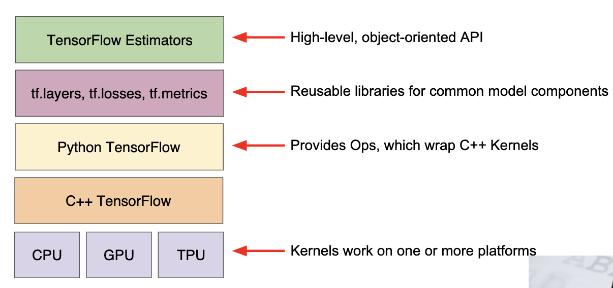
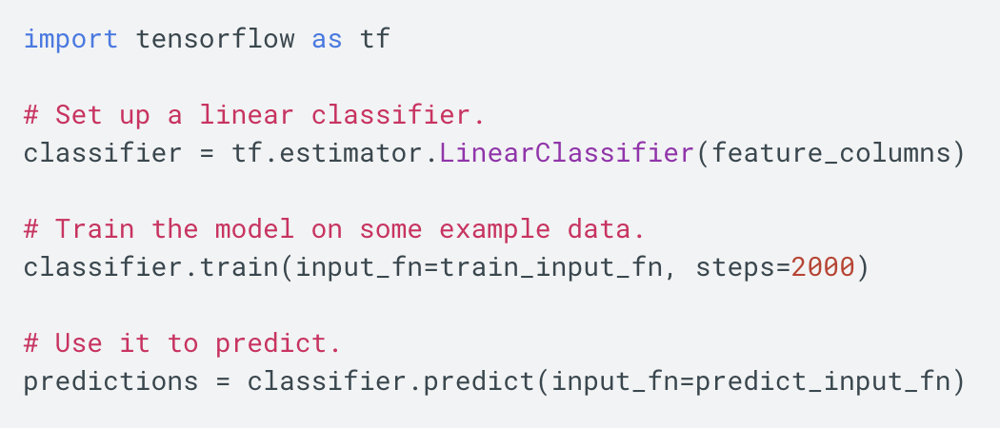

# First Steps with TensorFlow

---

## TensorFlow API Hierarchy

---

## TensorFlow tookits by layers

| Toolkits | Description |
|-|-|
| Estimator (tf.estimator) | High-level, OOP API |
| tf.layers / tf.losses / tf.metrics | Libraries for common model components |
| TensorFlow | Lower-level APIs |

* TensorFlow consists of the fowllowing two components:
  * a graph protocol buffer
  * a runtime that executes the (distributed) graph

---

## A Quick Look at the tf.esitmator API

---

## Programming Exercises

1. [Quick introduction to pandas](https://colab.research.google.com/notebooks/mlcc/intro_to_pandas.ipynb?utm_source=mlcc&utm_campaign=colab-external&utm_medium=referral&utm_content=pandas-colab&hl=en)
2. [First Steps with TensorFlow](https://colab.research.google.com/notebooks/mlcc/first_steps_with_tensor_flow.ipynb?utm_source=mlcc&utm_campaign=colab-external&utm_medium=referral&utm_content=firststeps-colab&hl=en)
3. [Synthetic Features and Outliers](https://colab.research.google.com/notebooks/mlcc/synthetic_features_and_outliers.ipynb?utm_source=mlcc&utm_campaign=colab-external&utm_medium=referral&utm_content=syntheticfeatures-colab&hl=en)

---

## Common hyperparameters in ML Crash Course exercises

* **steps**, which is the total number of training iterations. One step calculates the loss from *one batch* and uses that value to modify the models' weights *once*.
* **batch size**, which is the number of training examples (chosen at random) for a single step. For example, the batch size for SGD is 1.
* total number of training exampels = batch size * steps

---

## A convinience variable in ML Crash Course exercises

* **periods**, which controls the granularity of reporting. For example, if `periods` is set to 7 and `stpes` is set to 70, the the exercise will output the loss value every 10 steps (or 7 times). Unlike hyperparameters, we don't expect you to modify the value of `periods`. Note that modifying `periods` does not alter what your model learns.
* number of training example in each period = $ \frac{batch\ size \times steps}{periods} $
