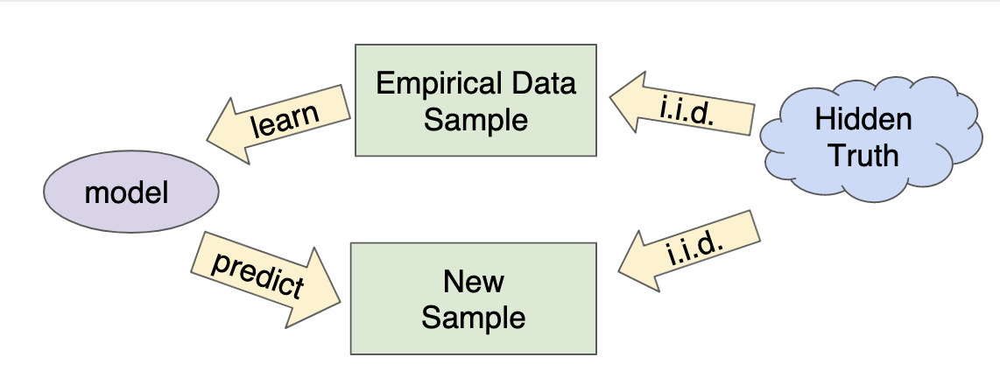
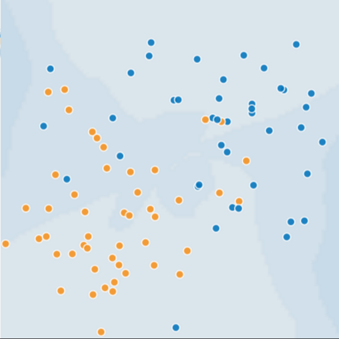

# Generalization

---

## The Big Picture

* Goal: predict well on new data drawn from (hidden) true distribution
* Problem: we don't see the truth
  * We only get to sample from it

---

## How do we know if our model is good (1)

* Theoretically:
  * Interesing field: generalization theory
  * Based on ideas of measuring model simplicity / complexity
* Intuition: formalization of Ockham's Razor principle
  * The less complex a model is, the more likely that a good empirical result is not just due to the peculiar

---

## How do we know if our model is good (2)

* Empirically:
  * Asking: will our model do well on a new sample of data?
  * Evaluate: get a new sample of data, call it the test set
  * Good performance on the test set is a useful indicator of good performance on the new data in general:
    * If the test set is large enough
    * If we don't cheat by using the test set over and over

---

## The ML fine print

### Three basic assumption in all of the above

1. We draw examples **independently and identically (i.i.d)** at random from the distribution. The data should not be biased.
2. The distribution is **stationary**: it doesn't change over time
   * This could be violated due to seasonal or sudden events.
3. We alwasy pull from the **same distribution**: Including training, valudation, and test sets
   * This assumption might be violated over time.

---

## Peril of overfitting

### Training sets

* The blue dots represent sick trees
* The orange dots represent healthy trees
