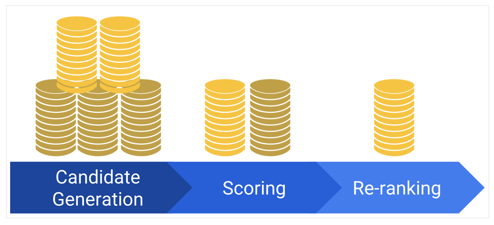

# 추천 시스템 개요

---

## 추천 시스템의 구성 요소

* 대부분의 추천 시스템이 아래의 요소로 구성
  * 후보 생성 (candidate generation)
  * 점수 매기기 (scoring)
  * 다시 순위 매기기 (re-ranking)

---

## Candidate Generation

* 첫 번째 단계에서 추천 시스템은 잠재적으로 거대한 자료에서 시작해서 훨씨니 더 작은 후보들의 부분 집합을 만듬
  * 예를 들어 유튜브의 경우 수십억 개의 영상에서 수십만 개의 영상으로 줄임
* 모델은 주어진 자료에서 빠르게 쿼리를 평가해야함
* 주어진 모델은 다수의 후보 생성기를 제공할 수 있고, 각 생성기는 서로 다른 후보지의 부분 집합을 올림

---

## 점수 매기기 (Scoring)

* 또 다른 모델은 사용자에게 보여줄 item 집합을 선정하기 위해 후보지들에 점수를 매기고 순위를 정함
* 이 모델은 상대적으로 작은 item 들의 부분 집합을 이용하기 때문에 추천 시스템은 추가적인 query 를 활용하는 보다 정확한 모델을 사용할 수도 있음

---

## 다시 순위 매기기 (Re-ranking)

* 마지막으로 추천 시스템에서는 최종 순위에 반영할 추가적인 제약에 대해 고려해야 함
  * 사용자가 싫어한 item 들을 제외하거나 새로운 item 에 보다 큰 가중치를 주는 등의 작업
* Re-ranking 을 통해 다양성, 새로움, 그리고 공정성 등을 확보할 수 있음

---

## References

* [The YouTube Video Recommendation System](https://www.inf.unibz.it/~ricci/ISR/papers/p293-davidson.pdf)
* [Deep Neural Networks for YouTube Recommendations](https://static.googleusercontent.com/media/research.google.com/en//pubs/archive/45530.pdf)
