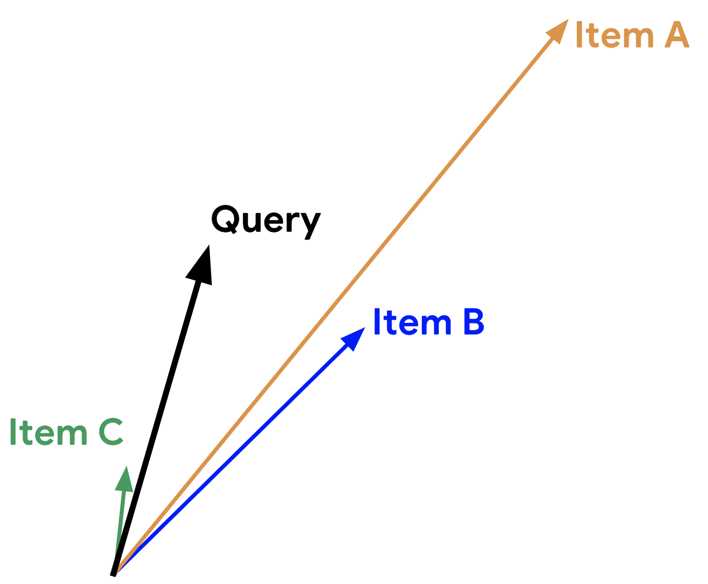

# Candidate Generation

* 후보지 생성 (candiate generation) 은 추천의 첫 번째 단계
* 주어진 query 를 통해 추천 시스템은 관련된 후보지 (candidates) 를 생성

---

## 후보지 생성 방법

| 종류 | 정의 | 사례 |
| - | - | - |
| 컨텐츠 기반 필터링 | *아이템간 유사도* 를 이용해서 사용자가 좋아한 아이템과 비슷한 것을 추천 | 사용자가 귀여운 고양이 영상을 두 개 보면 다른 귀여운 동물 영상을 추천 |
| 협업 필터링 | *쿼리와 아이템 간의 유사도를 동시에* 사용해서 추천을 제공 | A 사용자와 B 사용자가 비슷하고 B 사용자가 영상 1을 봤다면, A 사용자가 영상 1 과 유사한 것을 보지 않았더라도 이를 추천 |

---

## 임베딩 공간 (Embedding Space)

* contents-based filtering 과 collaborative filtering 둘 다 각각의 item 과 query (또는 context) 를 공통적인 임베딩 공간 $E = \mathbb{R}^d$ 상의 임베딩 벡터로 매핑함
* 일반적으로 임베딩 공간은 저차원(low-dimensional, $d$ 의 크기는 원래 corpus 크기보다 훨씬 작음)이며, item 또는 query 집합의 잠재 구조(latent structure) 를 잡아 내기도 함

## 유사도 척도

* 유사도 척도는 한 쌍의 임베딩을 받아서 둘의 유사도를 의미하는 스칼라값을 반환하는 함수
  * $s: E \times E -> \mathbb{R}$
* 임베딩은 다음과 같이 candidate generation 에 사용할 수도 있음
  * query 임베딩이 $q \in E$ 로 주어졌을 때 추천 시스템은 $q$ 와 가까운 item 임베딩 $x \in E$ 을 찾는데 이는 유사도 $s(q, x)$ 가 높은 임베딩들이라고 할 수 있음

---

### Cosine

* 두 벡터 $q$ 와 $x$ 사이의 각도에 대한 cosine 값
* $s(q, x) = cos(q, x)$

---

### Dot Product (내적)

* $s(q, x) = <q, x> = \sum^d_{i=1}q_i x_i$ = $\lVert q \rVert \lVert x \rVert cos(q, x)$
  * 두 벡터 사이의 각도에 대한 코사인 값과 두 벡터의 norm 을 곱한 값
  * 임베딩들을 normalize(길이를 1로 만듬) 하면 dot product 와 cosine 값은 같아짐

---

### Euclidina distinct (유클리드 거리)

* $s(q, x) = \lVert q - x \rVert = \sqrt{\sum^d_{i=1} (q_i - x_i)^2}$
  * 임베딩들을 normalize 하면 dot product, cosine 과 같은 값을 가짐

---

## 유사도 척도 비교하기

* 주어진 query 와의 거리가 가장 가까운 item 은 무엇인가?
  * Dot Product: Iteam A > Iteam B > Iteam C, 주어진 query 와의 각도가 모두 90도 미만으로 양수값을 가지는 상태에서 item 임베딩의 길이의 순서대로 높은 값을 가지기 때문
  * Cosine similarity: Item C > Iteam A > Item B, Cosine similarity 에서는 query 와 이루는 각도가 작을수록 ($cos(0) = 1$) 유사한 것이기 때문
  * Euclidean Distance: Item B > Item C > Item A, query 와 item 의 두 점사이의 거리가 가장 가까운 순서대로 유사하다고 판단하기 때문

---

### 어떤 유사도 척도를 사용해야 할까?

* cosine 에 비해 dot product 는 임베딩의 norm 에 큰 영향을 받음.
  * 학습용 데이터에서 매우 자주 나오는 item 들은 norm 값이 크게 나옴
  * 유명세에 기반을 하고자 한다면 사용해도 되지만, 주의를 기울이지 않으면 제일 유명한 item 들만을 추천함
  * 학습용 데이터에서 거의 나오지 않는 item 들은 자주 업데이트 되지 않는데, 초기에 굉장히 큰 norm 값이 주어진다면 더 관련이 있는 item 들보다 이것들을 추천하게 됨. 이러한 문제를 피하기 위해서는 임베딩 initialization 에 주의를 기울이고, 적절한 정규화 방법을 적용해야함
