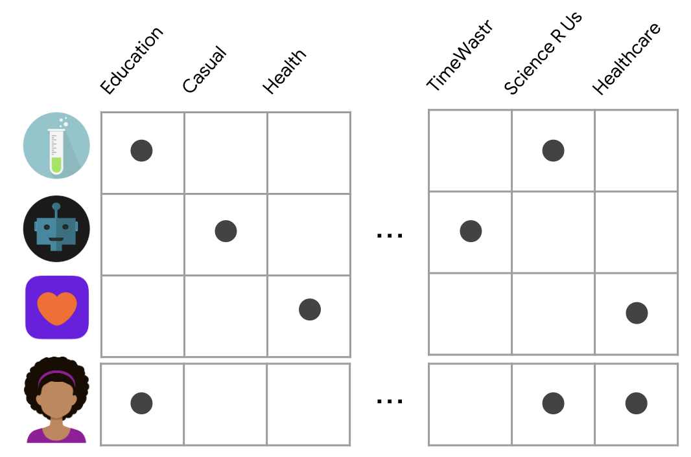

# Contents-based Filtering

---

## 개요

* 컨텐츠 기반 필터링에서는 사용자가 이전에 취한 행위나 명시적인 피드백을 통해 그의 취향과 비슷한 다른 item 을 추천하기 위해 item feature 를 사용

---

## 내적(Dot Product) 으로 유사도 구하기

* 사용자 임베딩 $x$ 와 앱 임베딩 $y$ 가 둘 다 이진 벡터라고 가정
* $<x, y> = \sum^d_{i=1}x_i y_i$ 
* 내적 값이 높다는 것은 공통된 특징(feature) 이 더 많다는 것이며, 높은 유사도를 가진다는 것을 의미

---

## 장점

* 추천 모델이 특정 사용자를 기반으로 작동하기 때문에 다른 사용자에 대한 데이터를 요구하지 않음. 때문에 다수의 사용자에 적용하기가 용이함
* 사용자의 구체적인 흥미를 잡아낼 수 있고, 소수의 사용자들만이 관심이 있는 니치 아이템(niche item) 도 잡아낼 수 있음
* 컨텐츠와 사용자의 규모가 작을 때에 사용에 유리함

## 단점

* 일정 단계까지는 feature representation 을 직접 해야하기 때문에 분야에 대한 지식을 요구함. 즉, 모델은 손으로 만든 특징 (hand-engineered features) 들의 수준만큼의 성능만을 보장함
* 사용자의 기존의 흥미에 대해서만 추천을 할 수 있음. 추천 모델이 사용자의 흥미를 넓혀주지는 못함
* 컨텐츠 feature 를 만드는 데에 큰 노동력이 들어감
