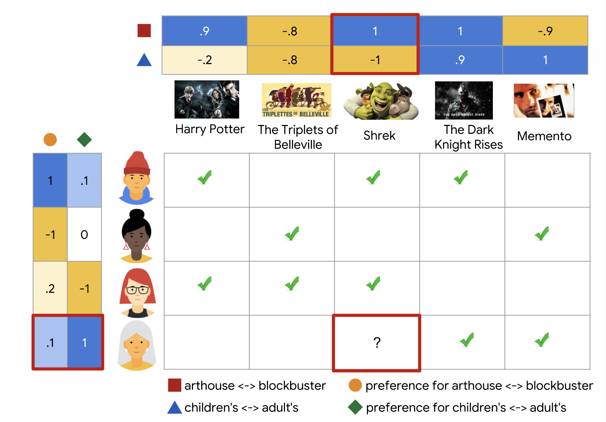

# Collaborative Filtering

---

## Overview

* 컨텐츠 기반 필터링의 단점을 보완하기 위해 협업 필터링에서는 *사용자와 아이템 사이의 유사도를 동시에* 사용한다.
* 협업 필터링 모델은 한 사용자에게 아이템을 추천할 때 다른 유사한 사용자의 흥미에 기반을 하기 때문에 우연히 취향에 맞는 추천을 주기도 한다.
* 그리고 수작업 피쳐 (hand-engineered feature) 에 의존하지 않고도 임베딩은 스스로 학습할 수 있다.

---

## 영화 추천 예제

* 각 행은 사용자를 의미
* 각 열은 아이템 (여기서는 영화) 을 의미
* 영화에 대한 피드백은 두 가지 카테고리가 존재
  * 명시적: 수치적인 평가로 얼마나 그 영화를 좋아했는지 나타낸 것(별점, 평점 등)
  * 암묵적: 사용자가 영화를 봤는지 안 봤는지만 나타내며, 이를 통해 흥미를 유추할 수 있음
* 사용자가 홈페이지를 방문하면 추천 시스템은 아래의 두 가지를 기반으로 영화를 추천해줘야함
  * 방문한 사용자가 과거에 좋아했던 영화와 유사한 영화
  * 방문한 사용자와 유사한 사용자가 좋아한 영화

---

### 영화 테이블

---

### 1D Embedding

* 각 영화에 [-1, 1] 사이의 값으로 이 영화가 아이들을 위한 것인지 (음수), 성일들을 위한 것인지 (양수) 를 나타내보자
* 각 사용자에게는 [-1, 1] 사이의 값으로 해당 사용자가 어린이 영화를 좋아하는지 (음수), 성인 영화를 좋아하는지 (양수) 를 나타낼 수 있다
* 어떤 사용자가 좋아할 것이라고 기대한 영화와 그 사용자의 곱(product) 은 1에 가까워야 한다
  * 어린이 영화(-1) * 어린이 영화를 좋아하는 사람 (-1) $\approx$ 1
  * 성인 영화(+1) * 성인 영화를 좋아하는 사람 (+1) $\approx$ 1

---

### 1D Embedding - scalar representation

* 동일한 스케일에서 나타낸 영화의 속성과 사용자의 선호도
  * 영화: 어린이 영화 - 성인 영화
  * 사용자: 어린이 영화 선호도 - 성인 영화 선호도
* 여기에서는 사용자가 어떤 영화를 봤는지를 한 번에 파악할 수 없음

---

### 1D Embedding - matrix representation

* 각 열은 사용자를 의미하며 그 옆의 숫자는 어린이-성인 영화 선호도를 의미
* 각 행은 영화를 의미하며, 그 위의 숫자는 어린이-성인 영화를 의미
* 행렬 안의 체크 표시는 해당 사용자가 해당 영화를 봤음을 의미

---

### 2D Embedding

* 하나의 피쳐만으로는 사용자의 선호도를 설명하기에 충분하지 않음
* 그래서 두 번째 피쳐를 추가하려고 함
  * 블록버스터 영화 <-> 예술 영화

---

### 2D Embedding example (1)

* X 축은 기존에 사용한 어린이 - 성인 영화
* 추가한 Y 축은 블록버스터 - 예술 영화

$\space$
$\space$
$\space$
$\space$
$\space$
$\space$
$\space$

---

### 2D Embedding example (2)

* 사용자와 아이템 벡터를 한 공간에 표현한 것이 놀랍게 보일 수도 있다
* 하지만 임베딩 공간을 유사도나 유사도 값을 사용해서 관계를 측정할 수 있는 아이템과 사용자에게 공통되는 추상적인 표현이라고 생각할 수도 있다

---

## Matrix Factorization

* 행렬 인수분해는 간단한 임베딩 모델이다
* 피드백 행렬 $A \in R^{m \times n}$ 이 주어졌을 때 모델은 다음을 학습한다 ($m$ 은 사용자의 수, $n$ 은 아이템의 갯수)
  * 사용자 임베딩 행렬 $U \in \mathbb{R}^{m \times d}$, 여기서 $i$ 번째 행은 사용자 $i$ 의 임베딩
  *  아이템 임베딩 행렬 $V \in \mathbb{R}^{n \times d}$, 여기서 $j$ 번째 행은 아이템 $j$ 의 임베딩

---

## 목적함수 선택하기

